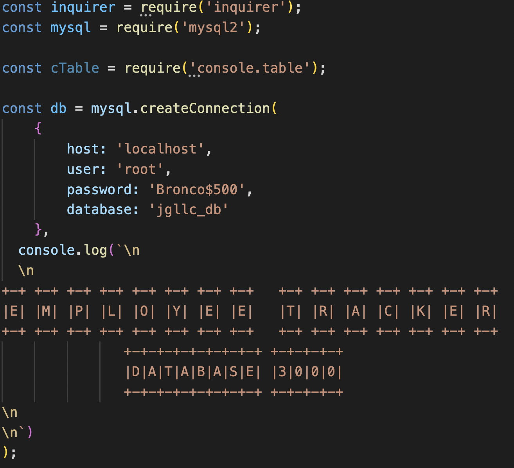
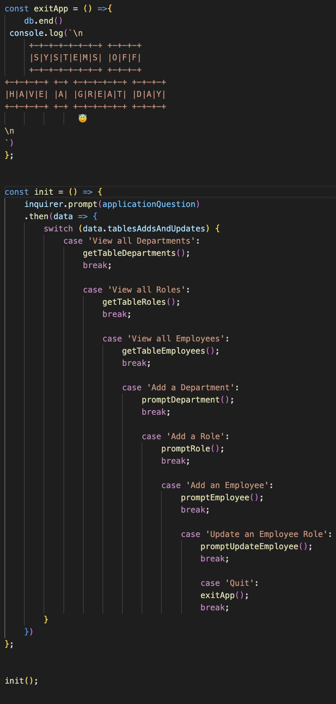
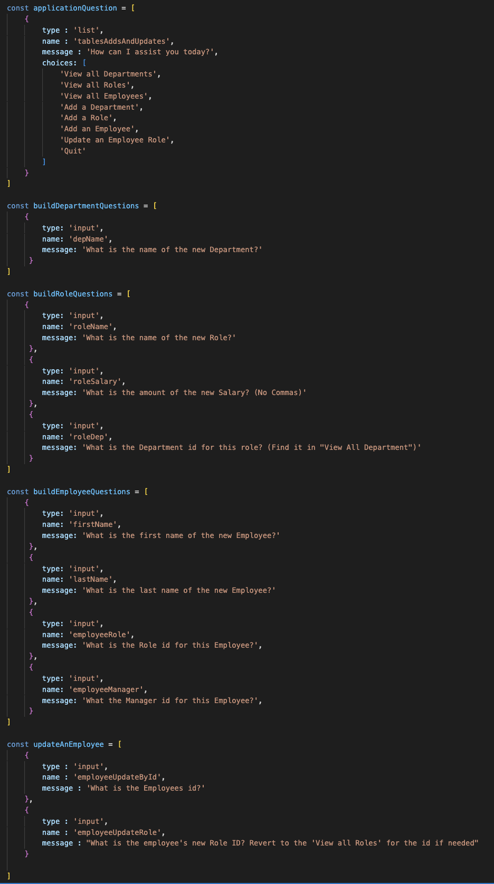
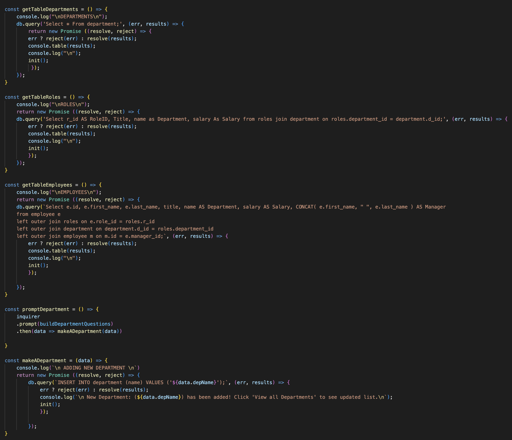
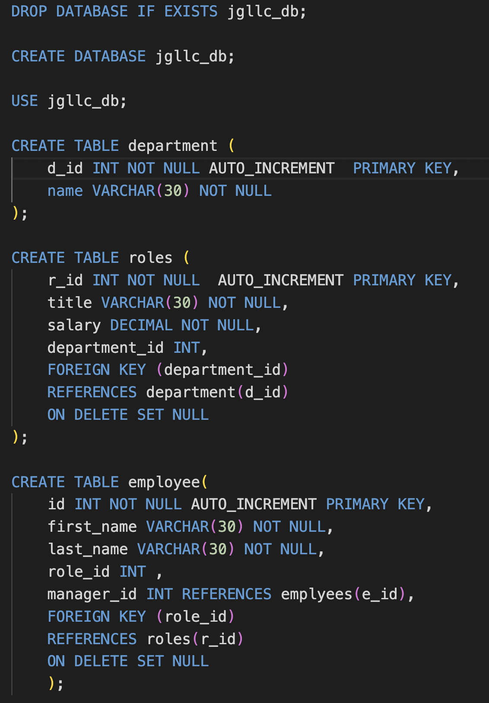
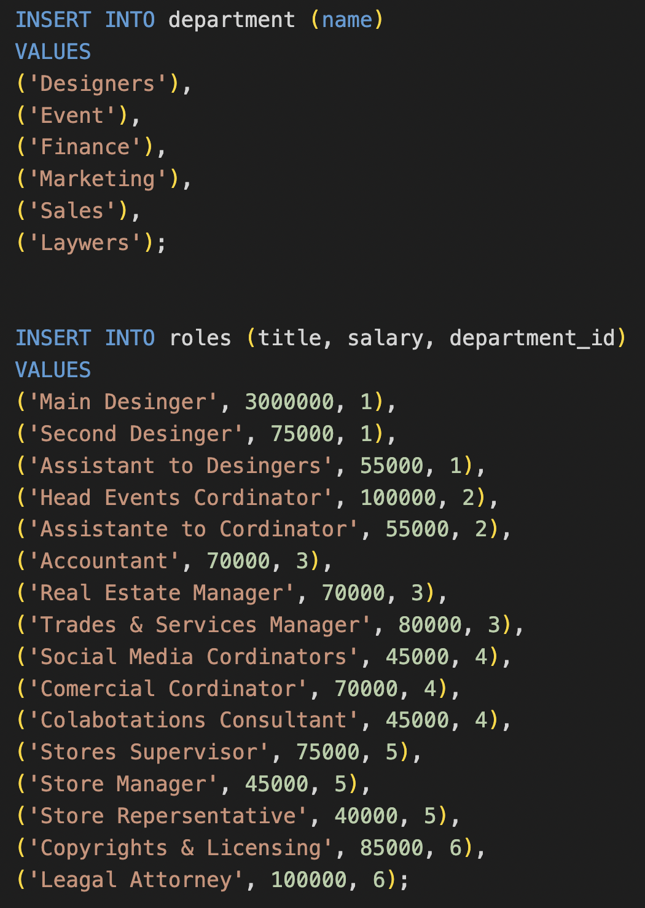
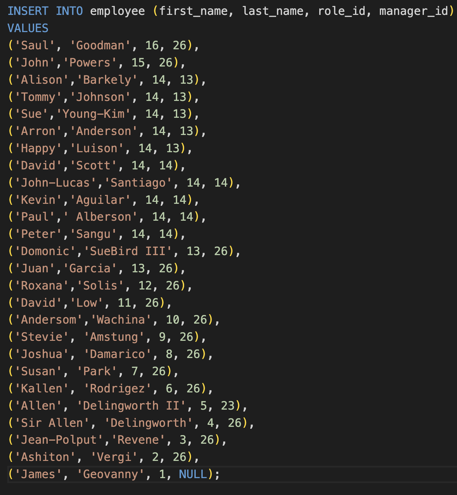
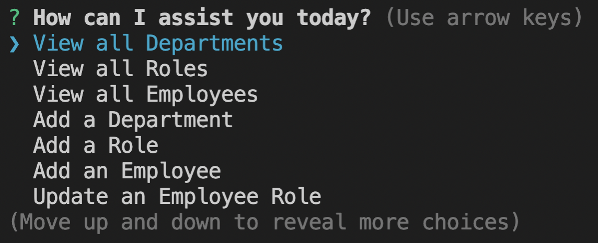
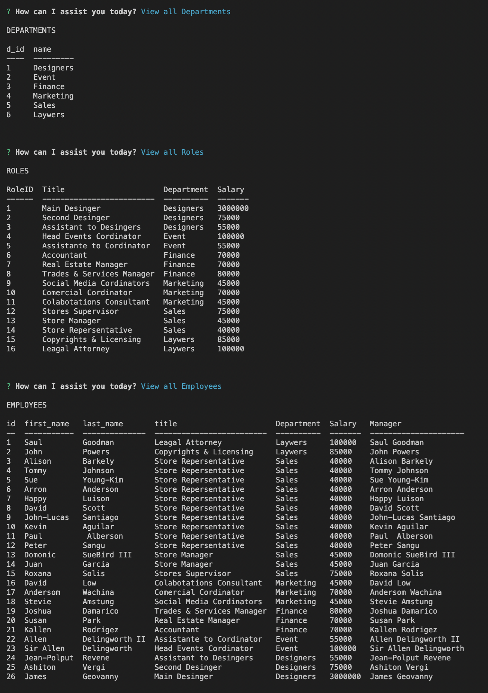

# Employee Tracker DataBase 3000 

   

  ## Description
  In this application we simply add Department, Roles, and Employees to make up a companies database.You can continue to add emplyees and roles as well as update roles.

  ## Table of Contents 
  - [Installation](#installation)
  - [Usage](#usage)

  ## Installation
  To install my program download the folder with all the files. Then make sure you also download the dependecies. Run "node index.js" and the program will start to ask you questions about your companie.

  ## Usage
  Once all the dependencies are added run the program. Select what you want to do and follow the instuctions.

  ## Questions
  Here is my email for questions:  jimmysolis14@gmail.com
   
  If you would like to look me up in github, here is my username: jimmysolis
   
  Follow these instructions to contact me:  
  Please Email me with any questions.

## How it works :

### 1) Here I add all the requirements:

### 2) Here is the code for begining and ending the app:

### 3) Here I have the needed questions for the prompt through inquire: 

### 4) Next I have the functions that are redirected to the inquire.
### In here is were we make the calls to the Mysql server for the info we want:

### 5) Here is my Schema!

     
     
### 6) Here are the seeds I used to make sure it works!

### 7) Here are the prompts:

### 8) Linke to video:

  